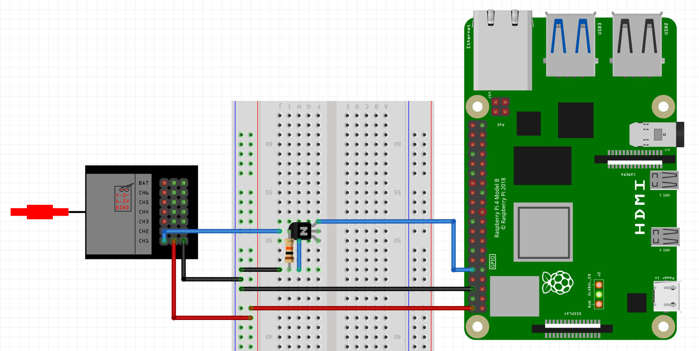
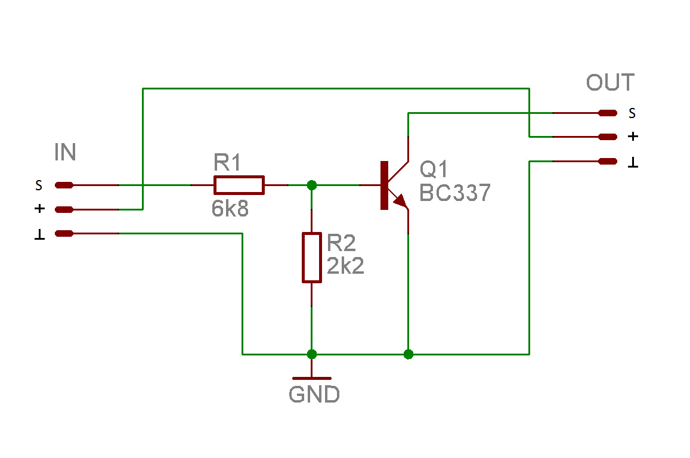
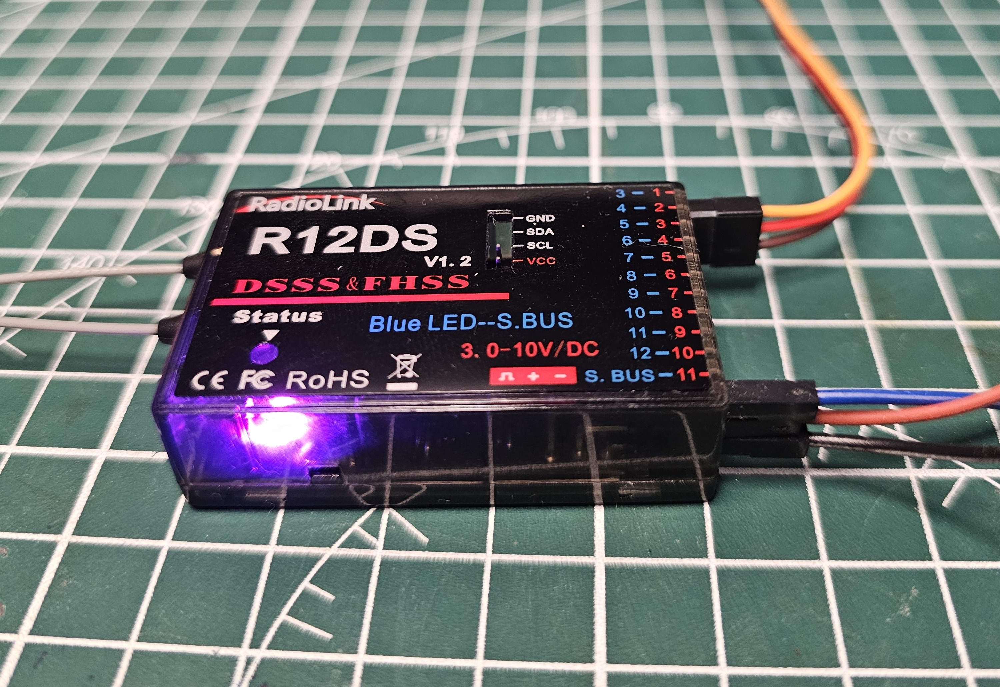

# 📡 SBUS Sniffer + Live Dashboard on Raspberry Pi 4

A complete project for real-time reception and visualization of RC SBUS channel data using a Radiolink R12DS receiver and a Raspberry Pi 4.

---

## ⚙️ Features

✅ Receive and decode **16 SBUS channels** from Radiolink R12DS receiver  
✅ Detect and display **Failsafe** and **Lost Frame** flags  
✅ Real-time graphical visualization in a web browser (**Dash + Plotly**)  
✅ Safe data write using atomic file replacement  
✅ Hardware SBUS inverter based on a single BC337 NPN transistor  
✅ Compatible with Raspberry Pi 4 & 5 (PL011 UART)

---

## 🎯 Live Demo

Below is an animated preview of the real-time dashboard displaying channel data:


---

## 🖥️ Hardware Setup

### Fritzing Diagram



### SBUS Inverter Circuit



**Components used:**
- NPN Transistor: **BC337**
- Resistor R1: **6.8 kΩ**
- Resistor R2: **2.2 kΩ**

The inverter inverts the logic level of the SBUS signal, which is inverted by standard and incompatible with Raspberry Pi's UART input.

---

### Real Hardware Photos

**Assembled inverter:**


**Radiolink R12DS receiver:**



---

## 🗂️ Project Structure

```
rpi-sbus-dashboard/
├── app.py         → Dash dashboard (HTTP server)
├── main.py        → SBUS sniffer (UART → JSON)
├── shared.json    → Data buffer (generated automatically)
└── README.md      → Project documentation
```

---

## 🔥 How it works

### 📄 main.py

- Opens UART port `/dev/serial0` with parameters:
  - Baudrate: **100000**
  - Parity: **EVEN**
  - Stopbits: **2**
- Reads SBUS data **byte by byte** and assembles complete SBUS frames (25 bytes each)
- Decodes the values of **16 channels**, plus **Lost Frame** and **Failsafe** flags
- After each frame:
  - Writes data to a temporary file `shared.tmp`
  - Atomically renames it to `shared.json` to guarantee data consistency
- Prints current channel values to terminal for debugging

### 📄 app.py

- Runs an HTTP server based on **Dash + Plotly + Bootstrap**
- Every **100 ms**, it reads the latest data from `shared.json`
- Displays a **bar chart** showing real-time values of all 16 SBUS channels
- Displays **Failsafe** and **Lost Frame** status indicators
- Accessible in a web browser at:
```
http://<Your_Raspberry_Pi_IP>:8050
```

---

## ⚙️ Requirements

- Raspberry Pi 4 or 5
- RC Receiver with SBUS output (e.g., Radiolink R12DS)
- Simple SBUS inverter (1 NPN transistor + resistors)
- Raspberry Pi system configuration:
  - `enable_uart=1`
  - `dtoverlay=disable-bt`
  - UART available at `/dev/serial0` (PL011 full UART)
- Python 3 + Libraries:
  - `dash`
  - `dash-bootstrap-components`
  - `pyserial`

Install dependencies:

```bash
pip install dash dash-bootstrap-components pyserial
```

---

## 🚀 Usage

1. Connect hardware according to the Fritzing diagram.
2. Launch the sniffer:
```bash
python3 main.py
```
3. In a separate terminal, start the dashboard:
```bash
python3 app.py
```
4. Open your browser at:
```
http://<Your_Raspberry_Pi_IP>:8050
```

---

## 🧠 SBUS Inverter Function

The SBUS protocol uses an **inverted UART signal**, which is not supported natively by Raspberry Pi UART.  
The hardware inverter based on a single NPN transistor ensures correct logic levels.

Inverter logic:
- When SBUS input is low → transistor conducts → output is high
- When SBUS input is high → transistor blocks → output is low

This way, the inverted SBUS signal is properly decoded by Raspberry Pi.

---

## 🧩 Further Development Ideas

✅ Possible extensions:
- CSV logging of channel data  
- Interactive historical channel graphs  
- Integration with Home Assistant or MQTT  
- Auto-start of sniffer and dashboard on Raspberry Pi boot

---

**Project created and tested by: destrudo@happycoder.com.pl**
